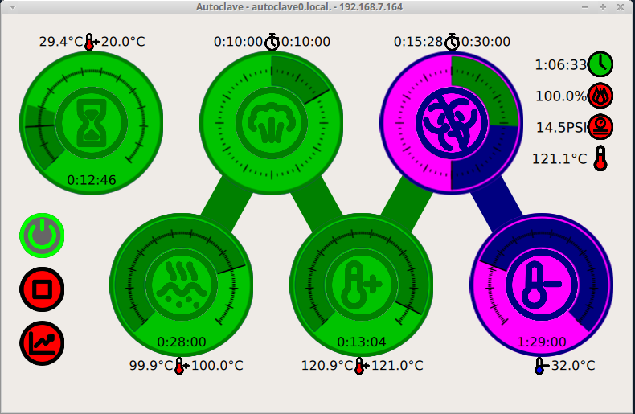

# Machinekit Autoclave control

This project is the design for an autoclave control using Machinekit
and a BeagleBone.  It controls a heat element and a pressure relief
valve using thermistors for input.

This repo is a rework of the [Goldibox][goldibox] project repo.

[goldibox]: https://github.com/zultron/goldibox/

## Components

The autoclave controller is a BeagleBone computer running Debian.  It
senses temperatures through a pair of thermistors attachd to its
analog inputs, and it switches the heat element and pressure relief
valve through two solid-state relays (SSRs) connected through GPIO
digital output pins.  See `electronics/autoclave.fzz` for connecting
them.

The [Machinekit][machinekit] software runs the configuration in this
repository:  some python user-space components in the `bin/`
directory, and HAL configuration in the `hal/` directory.  The
`autoclave-control` component decides whether to switch the relief
valve and burner on or off, depending on the program cycle and the
measured temperature.  The `autoclave-logger` component logs to a RRD
database, from which time series charts are generated.

The `autoclave-control` component exposes a remote UI, used by the
`MachinekitClient` software, which can be downloaded for Android from
the Google Play store, and for Linux, Mac OS X and Windows directly
from the [QtQuickVCP][qqvcp] project.  See the below screenshot.  The
idle, boil, steam and heat stages in green are done.  The current
stage is 8+ minutes into a 30 minute sterilization.  That and the
blue-colored cool stage are not yet done.  The button controls on the
left are enable/disable and start/stop.  The indicators on the upper
right are process elapsed time, burner duty cycle, pressure and
temperature.

FIXME:  configuration?

# Running

Follow the instructions at [machinekit.io][machinekit] to download
and install a mini-SD card image with Machinekit.

Log into the BeagleBone, clone this repository, and `cd` into the
repository directory.

On the BeagleBone, start the Autoclave control from the command line
(load the overlay file for non-system installs):

    # Install minimal apache and other config
    sudo make install MININSTALL=1
    # Start control
    bin/autoclave -o

The Autoclave should now be ready for control.  Start the
[MachinekitClient][qqvcp] and open the Autoclave app.

Alternatively, run an Autoclave simulated control and GUI in a Docker
container from the command line:

    # Start the container
    docker/qqvcp.sh
    # Install minimal apache and other config
    sudo make install MININSTALL=1
    # Start control
    bin/autoclave &
    # Start GUI
    MachinekitClient &

The Autoclave may be installed to the system so that it is run at
every boot:

    sudo make install
    sudo systemctl daemon-reload
    sudo systemctl enable autoclave
    sudo systemctl start autoclave

The `apache2` package must be installed and the web server running for
the time-series chart to work.

# Installing the BeagleBone

FIXME

[wiki-peltier]: https://en.wikipedia.org/wiki/Thermoelectric_cooling
[machinekit]: http://www.machinekit.io/
[qqvcp]: https://github.com/qtquickvcp/QtQuickVcp
