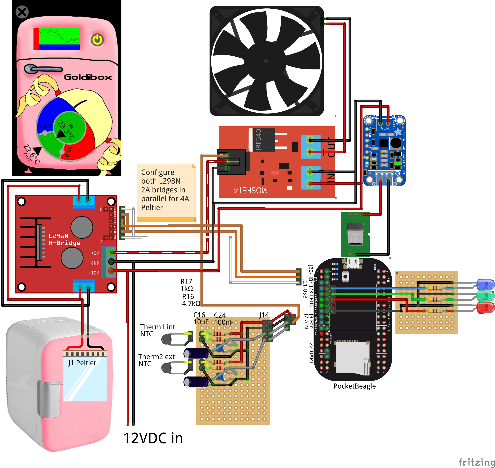

# Goldibox.  Not too hot, not too cold.

The Goldibox is an insulated box that maintains temperature using a
thermoelectric device and a controller.  Originally conceived to
incubate biological organisms that thrive best within a particular
maximum/minimum temperature range, it can both heat and cool to avoid
extremes, but still allow variability within a habitable "Goldilocks
zone":  not too hot, not too cold, but just right.

The Goldibox's smart controller exposes a remote, network-connected
graphical interface for setting temperatures, checking current state,
and viewing history through time series graphs.  Anyone may modify the
open-source control to add new features.

## Components

The Goldibox is built from a portable fridge with a [Peltier
junction][wiki-peltier] that can be switched either to cool or to heat
by reversing the input voltage.

The Goldibox controller, a tiny [PocketBeagle][pocketbeagle] computer
that runs Debian, fits in the cramped space next to the Peltier
junction fan and heat sink.  It senses internal and external
temperatures through a pair of thermistors attachd to its analog
inputs, and it switches the Peltier junction and fan through an
H-bridge and a MOSFET, respectively, connected through GPIO digital
output pins.  See `BOM.md` for a list of hardware components, and
`fritzing/goldibox.fzz` for connecting them.

The [Machinekit][machinekit] software runs the configuration in this
repository:  some python user-space components in the `bin/`
directory, and HAL configuration in the `hal/` directory.  The
`goldibox-control` component decides whether to switch the Peltier
junction to cool, heat, or off, depending on the measured temperature
compared to the user's Goldilocks temperature settings.  The
`goldibox-logger` component logs to a RRD database, from which time
series charts are generated.

The `goldibox-control` component exposes a remote UI, used by the
`MachinekitClient` software, which can be downloaded for Android from
the Google Play store, and for Linux, Mac OS X and Windows directly
from the [QtQuickVCP][qqvcp] project.  The configuration in the `qml`
directory defines the simple user interface with thermostat controls
for the "too hot" and "too cold" zones, readouts for internal and
external temperature, a power control to enable and disable the
Goldibox, and a time series chart showing temperatures over the last
day.

# Running

Follow the instructions at [machinekit.io][machinekit] to download
and install a mini-SD card image with Machinekit.

Log into the BeagleBone, clone this repository, and `cd` into the
repository directory.

On the PocketBeagle, start the Goldibox control from the command line
(load the overlay file for non-system installs):

    # Install minimal apache and other config
    sudo make install MININSTALL=1
    # Start control
    bin/goldibox -o

The Goldibox should now be ready for control.  Start the
[MachinekitClient][qqvcp] and open the Goldibox app.

Alternatively, run a Goldibox simulated control and GUI in a Docker
container from the command line:

    # Start the container
    docker/qqvcp.sh
    # Install minimal apache and other config
    sudo make install MININSTALL=1
    # Start control
    bin/goldibox &
    # Start GUI
    MachinekitClient &

The Goldibox may be installed to the system so that it is run at every
boot:

    sudo make install
    sudo systemctl daemon-reload
    sudo systemctl enable goldibox
    sudo systemctl start goldibox

The `apache2` package must be installed and the web server running for
the time-series chart to work.

# Installing the PocketBeagle

See the jumble of notes in [NOTES.md](NOTES.md)

[wiki-peltier]: https://en.wikipedia.org/wiki/Thermoelectric_cooling
[pocketbeagle]: https://beagleboard.org/pocket
[machinekit]: http://www.machinekit.io/
[qqvcp]: https://github.com/qtquickvcp/QtQuickVcp
